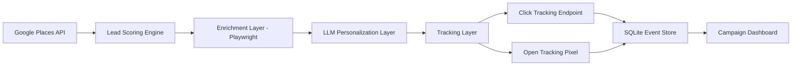

# GTM Automation Engine

Event-driven GTM engine for sourcing, prioritizing, and converting B2B leads with cost-aware personalization.

> Designed as a production-style GTM system combining lead intelligence, personalization, and performance analytics.

> Built as a configurable GTM pipeline with API exposure for integration into external growth and CRM workflows.

## The Problem

B2B outbound remains inefficient and difficult to scale:

- Lead sourcing and qualification are manual and time-intensive
- Outreach lacks contextual relevance, reducing response quality
- Messaging performance is rarely measured in a structured way
- Enrichment and personalization increase cost without clear ROI visibility

The result is low conversion, limited feedback loops, and inefficient growth spend.

## The Solution

This project implements a configurable outbound GTM engine that turns raw business data into prioritized, enriched leads and measurable outreach campaigns.

It is designed to simulate how modern growth teams operate: targeting, personalization, experimentation, and feedback loops within a single system.

- Sources leads from real business data
- Scores and prioritizes opportunities using location and quality signals
- Applies tiered enrichment to high-value leads only
- Generates personalized outreach using LLMs with deterministic A/B assignment
- Tracks engagement via event-based analytics (opens, clicks)
- Analyzes performance across segments, variants, and cost tiers

## System Capabilities

This system is designed as a reusable GTM pipeline, not a fixed demo.

Users can:

- Define target markets through configurable city, industry, and search terms
- Configure A/B offer variants and messaging strategies
- Customize company context, CTA destination, and value proposition prompts
- Control enrichment depth and cost-aware processing behavior
- Generate and export outreach campaigns
- Track engagement through open and click events

The backend exposes API endpoints for integration into external workflows, enabling use as:

- A standalone GTM tool
- A lead generation and outreach microservice
- A pipeline component inside broader RevOps systems

Planned integrations include CRM platforms such as HubSpot for downstream campaign and pipeline management.

## API-First Design

This system is built as a composable backend service.

All core functionality is exposed through REST endpoints:

- Lead sourcing and scoring
- Enrichment and processing
- Email generation (batch and per-lead)
- Event tracking (opens, clicks)
- Campaign analytics

This allows the engine to be integrated into:

- CRM workflows such as HubSpot
- Internal growth tooling
- Automation pipelines such as Zapier, n8n, or custom agents

## System Architecture



## Core Features

- Lead sourcing via Google Places API
- Scoring based on distance, reviews, and relevance
- Tiered enrichment for top-ranked leads
- Context-aware personalized outreach
- Deterministic A/B testing (offer variants)
- Event-based engagement tracking (open rate, CTR)
- Cost-aware processing pipeline
- Campaign analytics backed by SQLite

## How It Works

### 1. Lead sourcing

The system searches local businesses by city and keyword, expanding search radius dynamically until a target lead volume is reached.

Search parameters such as location, business type, and radius constraints are configurable to support different target markets.

### 2. Scoring and prioritization

Each lead is scored using business quality and operational relevance signals such as:

- Rating
- Review count
- Website presence
- Distance from the target market center

This enables consistent prioritization and downstream segmentation for outreach and analytics.

### 3. Tiered enrichment

Only the highest-priority leads go through more expensive enrichment steps:

- Google Places detail lookups
- Website scraping with Playwright
- Website summarization and service inference

This ensures compute is allocated where it has the highest expected conversion impact.

### 4. Outreach generation

The outreach system uses two paths:

- **High-score leads** use prompt-driven Gemini personalization
- **Lower-score leads** use reusable generated templates to reduce cost while preserving relevance

Each lead is deterministically assigned to an A/B variant to ensure consistent experiment grouping and reliable performance comparison.

Company context and offer variants are defined through prompt configuration, allowing the same system to be reused across different business models.

### 5. Event tracking

Generated emails include:

- A unique tracked CTA link for click tracking
- An HTML tracking pixel for open tracking

All events are stored in SQLite and rolled up into campaign analytics.

## Example Generated Outreach

```text
Hi Joe's Garage,

Noticed you offer collision and repair services in Austin. We help repair shops reduce downtime with dependable parts delivery and flexible billing that helps keep bays moving without tightening cash flow.

You can check out our service at [Tracked Link]

Best,
XYZ Parts
```

## Metrics Tracked

- Open Rate
- Click-Through Rate (CTR)
- Click-to-Open Rate (CTOR)
- Cost per Lead
- Cost per Click
- Cost per Engagement
- Performance by A/B variant
- Performance by lead score band
- Performance by enrichment level
- Performance by city and segment

## Example API Usage

### Search and Prioritize Leads

`POST /api/leads/search`

Request:

```json
{
  "city": "Austin, TX",
  "keyword": "auto repair shop"
}
```

Response:

```json
{
  "leads": [
    {
      "id": "place_123",
      "name": "Joe's Garage",
      "leadScore": 85,
      "enrichmentStatus": "enriched"
    }
  ],
  "searchMetadata": {
    "targetMinLeads": 30,
    "targetMaxLeads": 60,
    "topEnrichCount": 20
  }
}
```

## Demo

A frontend-only demo can be deployed using preloaded campaign data.

It simulates:

- Lead sourcing and scoring outputs
- Tiered enrichment behavior
- LLM-assisted outreach
- A/B variant assignment
- Engagement tracking (open and click events)
- Campaign-level analytics

This allows reviewers to interact with the system without requiring API keys or backend setup.

The full system with live APIs, enrichment, and tracking runs locally or in a deployed backend environment.

## A/B Testing

Two offer variants are tested:

- **Variant A**: Flexible billing / pay after job completion
- **Variant B**: Same-day / next-day delivery

Each lead is assigned a stable variant so the same business stays in the same bucket across runs. That makes it possible to compare engagement by variant, segment, and cost profile.

## Event Tracking

- Unique tracking links are generated per lead
- A redirect endpoint records click events before sending the user to the destination URL
- HTML emails include an open-tracking pixel
- Events are stored in SQLite and aggregated for analytics
- Event-level data enables flexible segmentation and performance analysis

## API & Integration Layer

The system exposes backend endpoints to support integration into external tools and workflows.

Core capabilities include:

- Lead sourcing and scoring endpoints
- Email generation endpoints for both batch and per-lead workflows
- Event tracking endpoints for open and click tracking
- Campaign analytics endpoints for aggregated metrics

This allows the system to function as a composable GTM service inside larger pipelines, including CRM systems, automation platforms, or internal tooling.

Future work includes direct CRM integrations such as HubSpot for syncing leads, campaigns, and engagement data.

## Key Design Decisions

- **Event-based tracking over counters**
  Enables flexible analytics such as unique versus total opens, segmentation, and variant analysis.

- **Tiered enrichment**
  Expensive operations such as scraping and LLM processing are applied only to high-signal leads.

- **Deterministic A/B assignment**
  Ensures experiment grouping remains stable across runs.

- **Separation of generation and tracking**
  The LLM handles content generation while the system handles analytics and instrumentation.

- **Prompt-driven configuration**
  Business context and offer logic are externalized so the system can be reused across industries.

## System Design Principles

This project is designed to demonstrate three layers of GTM engineering:

- **Growth thinking**
  - A/B testing
  - message performance measurement
  - segmentation by score, city, and enrichment

- **RevOps thinking**
  - cost per lead
  - cost-aware enrichment
  - tiered processing and resource allocation

- **Engineering thinking**
  - multi-stage enrichment pipeline
  - event-based tracking architecture
  - separation between sourcing, scoring, generation, and analytics

## Tech Stack

- Node.js
- Express
- React
- Vite
- Tailwind CSS
- Google Places API
- Playwright
- Gemini API
- SQLite

## Project Structure

```text
/client    React dashboard UI
/server    Express API, tracking, scoring, enrichment, email generation
/prompts   Company context, offer variants, reusable generated templates
```

## Running Locally

1. Clone the repo
2. Add your API keys to `.env`
3. Install dependencies
4. Install Playwright Chromium
5. Start the app

```bash
npm install
npm install --prefix server
npm install --prefix client
npx playwright install chromium --prefix server
npm run dev
```

The app runs locally at:

- Frontend: `http://localhost:5173`
- Backend: `http://localhost:3001`

Minimum `.env` values:

```env
GOOGLE_PLACES_API_KEY=
GEMINI_API_KEY=
GEMINI_MODEL=gemini-3-flash-preview
PORT=3001
CLIENT_ORIGIN=http://localhost:5173
TARGET_MIN_LEADS=30
TARGET_MAX_LEADS=60
TOP_ENRICH_COUNT=20
INITIAL_SEARCH_RADIUS_MILES=5
MAX_SEARCH_RADIUS_MILES=50
```

Prompt-driven company and offer context lives in:

- `prompts/company.md`
- `prompts/company-name.md`
- `prompts/company-url.md`
- `prompts/offers/offer_a.md`
- `prompts/offers/offer_b.md`

## Future Improvements

- CRM integration with HubSpot or Salesforce
- Real outbound sending via SMTP or email APIs
- Multi-step sequences and reply tracking
- Revenue attribution and conversion tracking
- Queueing, caching, and provider-level telemetry

## Why This Project Matters

This project demonstrates how a modern GTM system can:

- source demand intelligently
- personalize where it matters
- control cost through staged processing
- create a measurable feedback loop from outreach to engagement

It reflects the intersection of growth strategy, RevOps, and applied AI systems.

It is designed not just as a demonstration, but as a modular system that can be integrated into real GTM and RevOps workflows.
