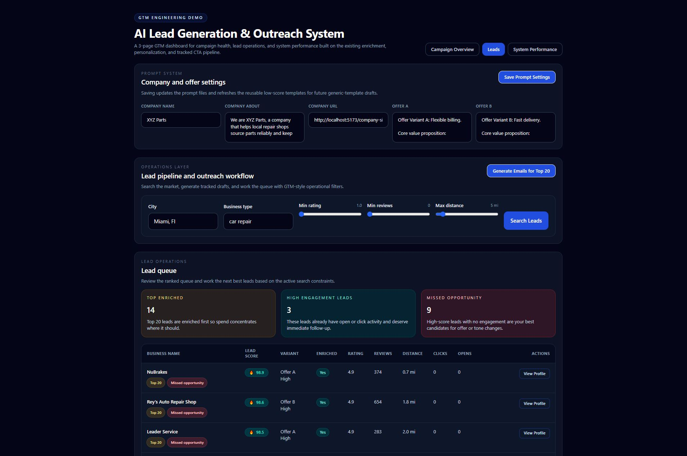
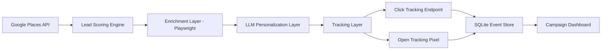

# GTM Automation Engine
 
 Plug-and-play GTM automation for local B2B pipelines with Gemini-powered personalization, deterministic A/B testing, cost-aware enrichment, HubSpot sync, and real-time engagement analytics.

> Production-style outbound system for sourcing leads, generating personalized emails, syncing CRM activity, and measuring campaign performance in one workflow.

 **Live demo:** https://codingtheblocks.github.io/gtm-automation-engine/

 

 ## The Problem
 
Local B2B outreach is slow, manual, and difficult for non-technical users. Even modern GTM stacks struggle to deliver an end-to-end solution for small to mid-size businesses:

- Sourcing high-quality leads in specific cities or neighborhoods
- Generating personalized outreach without writing copy for every lead
- Running reliable A/B test campaigns at scale without engineering support
- Tracking engagement metrics like opens, clicks, and CTR in real time
- Controlling enrichment costs and API usage for budget-conscious teams
- Integrating lead and engagement data seamlessly into existing CRM workflows

Most tools handle only one piece of the workflow, such as scoring, enrichment, or outreach, forcing teams to stitch together disconnected systems. Non-technical users still lack a ready-to-go solution for local B2B campaigns with instant A/B testing and measurable results.

## The Solution

This project provides a ready-to-go, end-to-end GTM automation system for local B2B outreach. Non-technical users can instantly launch A/B email campaigns with measurable results, without manually combining multiple tools.

- **Local lead sourcing:** search and score B2B leads by city, keyword, reviews, distance, and relevance
- **Cost-aware enrichment:** apply expensive enrichment only to the highest-value leads to control budget and API usage
- **Plug-and-play personalization:** drop in your company info, about text, site URL, and offers; Gemini automatically tailors outreach for each lead
- **Deterministic A/B testing:** assign leads consistently to variant A or B for reliable experiment results
- **Event-driven tracking:** log opens and clicks in real time, with CTR, open rate, and other metrics
- **CRM integration:** sync contacts and engagement activity to HubSpot for downstream pipeline and automation support
- **API exposure:** all functionality available via backend endpoints for integration into custom workflows or RevOps pipelines

Result: users get a fully automated local B2B outreach engine that handles lead sourcing, personalization, A/B experimentation, tracking, and CRM sync in a single plug-and-play system.

## Why This System is Different

- **Local B2B focus:** filter leads by city, reviews, and operational relevance
- **Automated A/B testing:** deterministic variant assignment for consistent experiment tracking
- **LLM personalization:** Gemini generates tailored outreach per lead
- **Event-driven metrics:** track opens and clicks with HubSpot integration
- **Cost-aware enrichment:** allocate expensive processing only to high-value leads
- **API-first design:** integrate into existing CRM and automation workflows

## System Capabilities

This system is designed as a reusable GTM pipeline, not a fixed demo.

Users can:

- Define target markets through configurable city, industry, and search terms
- Configure A/B offer variants and messaging strategies
- Customize company context, CTA destination, and value proposition prompts
- Control enrichment depth and cost-aware processing behavior
- Generate and export outreach campaigns
- Track engagement through open and click events

The backend exposes API endpoints for integration into external workflows, enabling use as:

- A standalone GTM tool
- A lead generation and outreach microservice
- A pipeline component inside broader RevOps systems

Ready to go integrations with CRM platforms like HubSpot for downstream campaign and pipeline management.

## API-First Design

This system is built as a composable backend service.

All core functionality is exposed through REST endpoints:

- Lead sourcing and scoring
- Enrichment and processing
- Email generation (batch and per-lead)
- Event tracking (opens, clicks)
- Campaign analytics

This allows the engine to be integrated into:

- CRM workflows such as HubSpot
- Internal growth tooling
- Automation pipelines such as Zapier, n8n, or custom agents

## System Architecture



## Core Features

- Lead sourcing via Google Places API
- Scoring based on distance, reviews, and relevance
- Tiered enrichment for top-ranked leads
- Context-aware personalized outreach
- Deterministic A/B testing (offer variants)
- Event-based engagement tracking (open rate, CTR)
- Cost-aware processing pipeline
- Campaign analytics backed by SQLite

## How It Works

### 1. Lead sourcing

The system searches local businesses by city and keyword, expanding search radius dynamically until a target lead volume is reached.

Search parameters such as location, business type, and radius constraints are configurable to support different target markets.

### 2. Scoring and prioritization

Each lead is scored using business quality and operational relevance signals such as:

- Rating
- Review count
- Website presence
- Distance from the target market center

This enables consistent prioritization and downstream segmentation for outreach and analytics.

### 3. Tiered enrichment

Only the highest-priority leads go through more expensive enrichment steps:

- Google Places detail lookups
- Website scraping with Playwright
- Website summarization and service inference

This ensures compute is allocated where it has the highest expected conversion impact.

### 4. Outreach generation

The outreach system uses two paths:

- **High-score leads** use prompt-driven Gemini personalization
- **Lower-score leads** use reusable generated templates to reduce cost while preserving relevance

Each lead is deterministically assigned to an A/B variant to ensure consistent experiment grouping and reliable performance comparison.

Company context and offer variants are defined through prompt configuration, allowing the same system to be reused across different business models.

### 5. Event tracking

Generated emails include:

- A unique tracked CTA link for click tracking
- An HTML tracking pixel for open tracking

All events are stored in SQLite and rolled up into campaign analytics.

## Example Generated Outreach

```text
Hi Joe's Garage,

Noticed you offer collision and repair services in Austin. We help repair shops reduce downtime with dependable parts delivery and flexible billing that helps keep bays moving without tightening cash flow.

You can check out our service at [Tracked Link]

Best,
XYZ Parts
```

## Metrics Tracked

- Open Rate
- Click-Through Rate (CTR)
- Click-to-Open Rate (CTOR)
- Cost per Lead
- Cost per Click
- Cost per Engagement
- Performance by A/B variant
- Performance by lead score band
- Performance by enrichment level
- Performance by city and segment

## Example API Usage

### Search and Prioritize Leads

`POST /api/leads/search`

Request:

```json
{
  "city": "Austin, TX",
  "keyword": "auto repair shop"
}
```

Response:

```json
{
  "leads": [
    {
      "id": "place_123",
      "name": "Joe's Garage",
      "leadScore": 85,
      "enrichmentStatus": "enriched"
    }
  ],
  "searchMetadata": {
    "targetMinLeads": 30,
    "targetMaxLeads": 60,
    "topEnrichCount": 20
  }
}
```

## A/B Testing

The system supports deterministic A/B testing of offer variants so every lead stays in the same bucket across runs.

- **Default demo example:**
  - Variant A: Flexible billing / pay after job completion
  - Variant B: Same-day / next-day delivery
- **Customizable:** Replace the default offers with any messaging, promotion, or CTA to run your own experiments.
- **Reliable measurement:** Stable assignment enables clean comparisons of engagement by variant, segment, enrichment tier, and cost profile.

## Event Tracking

- Unique tracking links are generated per lead
- A redirect endpoint records click events before sending the user to the destination URL
- HTML emails include an open-tracking pixel
- Events are stored in SQLite and aggregated for analytics
- Event-level data enables flexible segmentation and performance analysis

## API & Integration Layer

The system exposes backend endpoints to support integration into external tools and workflows.

Core capabilities include:

- Lead sourcing and scoring endpoints
- Email generation endpoints for both batch and per-lead workflows
- Event tracking endpoints for open and click tracking
- Campaign analytics endpoints for aggregated metrics

This allows the system to function as a composable GTM service inside larger pipelines, including CRM systems, automation platforms, or internal tooling.

Future work includes direct CRM integrations such as HubSpot for syncing leads, campaigns, and engagement data.

## Key Design Decisions

- **Event-based tracking over counters**
  Enables flexible analytics such as unique versus total opens, segmentation, and variant analysis.

- **Tiered enrichment**
  Expensive operations such as scraping and LLM processing are applied only to high-signal leads.

- **Deterministic A/B assignment**
  Ensures experiment grouping remains stable across runs.

- **Separation of generation and tracking**
  The LLM handles content generation while the system handles analytics and instrumentation.

- **Prompt-driven configuration**
  Business context and offer logic are externalized so the system can be reused across industries.

## System Design Principles

This project is designed to demonstrate three layers of GTM engineering:

- **Growth thinking**
  - A/B testing
  - message performance measurement
  - segmentation by score, city, and enrichment

- **RevOps thinking**
  - cost per lead
  - cost-aware enrichment
  - tiered processing and resource allocation

- **Engineering thinking**
  - multi-stage enrichment pipeline
  - event-based tracking architecture
  - separation between sourcing, scoring, generation, and analytics

## Tech Stack

- Node.js
- Express
- React
- Vite
- Tailwind CSS
- Google Places API
- Playwright
- Gemini API
- SQLite

## Project Structure

```text
/client    React dashboard UI
/server    Express API, tracking, scoring, enrichment, email generation
/prompts   Company context, offer variants, reusable generated templates
```

## Running Locally

1. Clone the repo
2. Add your API keys to `.env`
3. Install dependencies
4. Install Playwright Chromium
5. Start the app

```bash
npm install
npm install --prefix server
npm install --prefix client
npx playwright install chromium --prefix server
npm run dev
```

The app runs locally at:

- Frontend: `http://localhost:5173`
- Backend: `http://localhost:3001`

Minimum `.env` values:

```env
GOOGLE_PLACES_API_KEY=
GEMINI_API_KEY=
GEMINI_MODEL=gemini-3-flash-preview
HUBSPOT_ENABLED=true
HUBSPOT_ACCESS_TOKEN=
PORT=3001
CLIENT_ORIGIN=http://localhost:5173
TARGET_MIN_LEADS=30
TARGET_MAX_LEADS=60
TOP_ENRICH_COUNT=20
INITIAL_SEARCH_RADIUS_MILES=5
MAX_SEARCH_RADIUS_MILES=50
```

### HubSpot Setup

1. Go to **Settings → Properties → Contact Properties**.
2. Create the following custom properties:
    - `lead_score` (Number)
    - `ab_variant` (Dropdown: A, B)
    - `enrichment_level` (Dropdown: full, partial, none)
    - `source` (Text)
3. Create a **Private App** and copy the **Access Token** into your `.env`:

```env
HUBSPOT_ENABLED=true
HUBSPOT_ACCESS_TOKEN=your_token_here
```

Make sure the following scopes are enabled:

- `crm.objects.contacts.read`
- `crm.objects.contacts.write`
- `crm.objects.notes.read`
- `crm.objects.notes.write`

This is enough to enable HubSpot contact sync and engagement note logging.

### Google Places API Key

1. Go to [Google Cloud Console → APIs & Services → Credentials](https://console.cloud.google.com/apis/credentials).
2. Create a new API key.
3. Enable the **Places API** for your project.
4. Add the key to `.env`:

```env
GOOGLE_PLACES_API_KEY=your_key_here
```

Google Places powers lead search, location-aware scoring inputs, and phone/detail enrichment.

### Gemini 3 Preview API

1. Go to [Google AI Studio → Gemini 3 Flash Preview](https://studio.google.com).
2. Create or copy your API key.
3. Add it to `.env`:

```env
GEMINI_API_KEY=your_key_here
GEMINI_MODEL=gemini-3-flash-preview
```

Gemini powers the prompt-driven personalization path used for high-value leads and reusable template generation.

Prompt-driven company and offer context lives in:

- `prompts/company.md`
- `prompts/company-name.md`
- `prompts/company-url.md`
- `prompts/offers/offer_a.md`
- `prompts/offers/offer_b.md`

## Future Improvements

- Real outbound sending via SMTP providers or transactional email APIs
- Multi-step sequences plus reply tracking and thread-level attribution
- Automation triggers for n8n, Zapier, or internal schedulers to kick off workflows
- Revenue attribution and conversion tracking tied to HubSpot opportunities
- Queueing, caching, and provider-level telemetry for higher-volume throughput

## Why This Project Matters

This project demonstrates how a modern GTM system can:

- source demand intelligently
- personalize where it matters
- control cost through staged processing
- create a measurable feedback loop from outreach to engagement

It reflects the intersection of growth strategy, RevOps, and applied AI systems.

It is designed not just as a demonstration, but as a modular system that can be integrated into real GTM and RevOps workflows.
